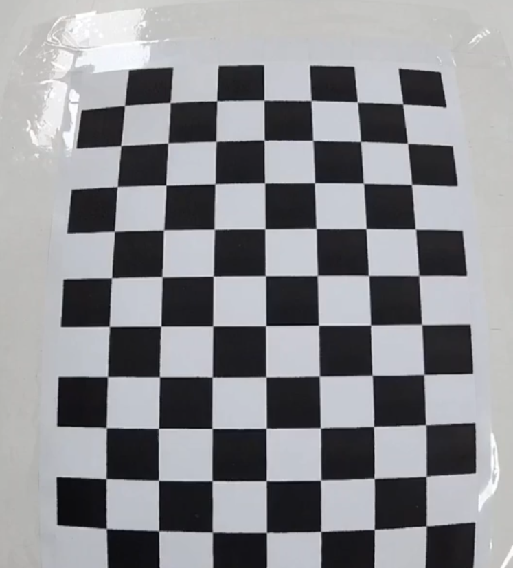
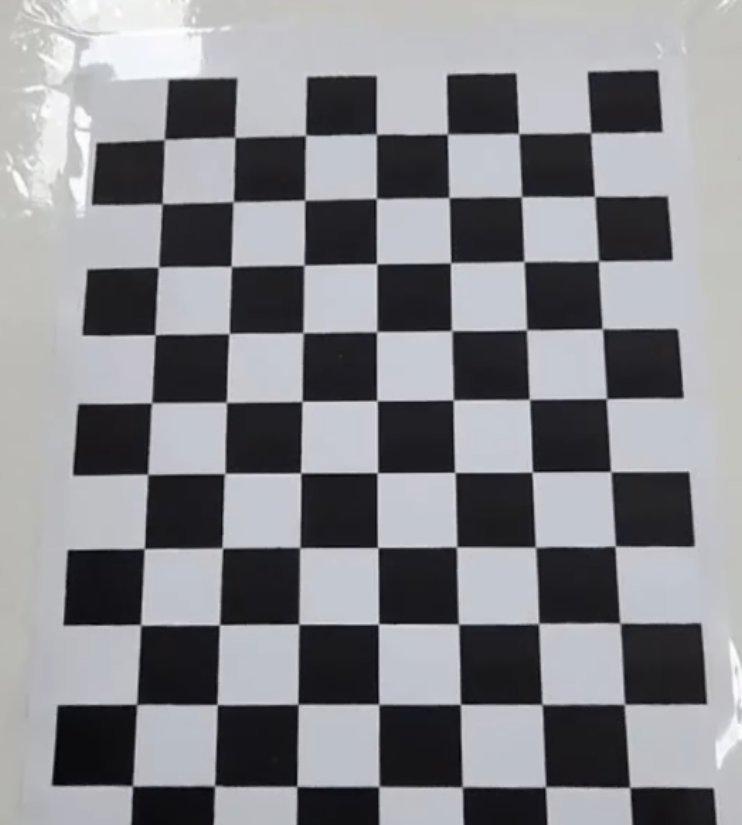

# 📸 Pressing Fisheye

비디오에서 일정 간격으로 이미지를 추출하고, 카메라 캘리브레이션용 체스보드 패턴을 감지하는 파이썬 유틸리티 스크립트입니다.

## 📌 주요 기능

* **비디오 프레임 자동 추출 (`select_img`)**
  * 영상 파일에서 지정된 시간(ms) 간격으로 이미지를 추출합니다.
  * 프레임 건너뛰기(Frame-skipping) 방식을 적용하여 영상 재생 위치 탐색 시 발생하는 무한 루프 버그를 방지하고 추출 속도를 높였습니다.

* **캘리브레이션 데이터 준비 (`calib_camera_from_chessboard`)**
  * 추출된 이미지 목록을 순회하며 체스보드의 코너 좌표 포인트를 탐지합니다.
  * 데이터 누락으로 인한 캘리브레이션 연산 에러를 방지하기 위한 안전장치(`assert`)가 포함되어 있습니다.

## 출력 결과

* **카메라 매트릭스 (K)**
  * [[968.8114115    0.         255.18599104]
 [  0.         956.46237995 353.22691164]
 [  0.           0.           1.        ]]
* **왜곡 계수 (dist_coeffs)**
  * [[-0.63305567 -0.40140644  0.00243042  0.00569096  0.98323552]]  
* **재투영 오차 (RMSE)**
  * 0.7549680760763284  

* **추출된 이미지 예시**
  * 
    * 